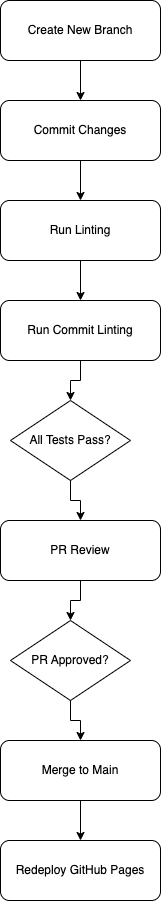

# Phase 1: CI/CD Pipeline Status Report

## Introduction

This document provides an overview of the current status of our CI/CD pipeline setup. It details which aspects of the pipeline are in prod, future implementations, and planned contributions. Our goal is to establish a robust, automated process that ensures/enforces **code quality** and smooth deployment.

## Current Pipeline Configuration

As of now, our CI/CD pipeline is structured to enforce quality code via automated tests and code reviews before any code is merged into the main branch. Below is an overview of the steps currently implemented:

1. **Branch Creation**: Developers are required to create new branches for every new set of features or fixes. This ensures that the `main` branch remains stable.

2. **Commit and Push**: Changes are committed to these branches. Commit messages must follow the Conventional Commit's style guide.

3. **Automated Linting**: Pushed commits trigger automated linting processes to check for syntax errors and enforce coding standards.

4. **Commit Message Linting**: Alongside code linting, commit messages are also verified against standard formats to maintain consistency.

5. **Pull Request (PR) Creation**: Once linting passes, a PR is created for code review.

6. **Code Review**: The PR must be reviewed and approved by at least one team member. This step ensures that all code is reviewed for quality and functionality.

7. **Merge to Main**: Approved PRs are merged into the main branch, which triggers the final deployment step.

8. **Deployment**: Changes in the `main` branch automatically trigger the deployment to GitHub Pages, ensuring that our latest build is always available.

*Note that although this is an electron app we deploy continously to GH pages to give a livetime product experience to our developers and stakeholders (the prof)*

Below is a diagrammatic representation of our current CI/CD pipeline:

  <!-- Update this with the actual URL of your uploaded diagram -->

## In Progress and Planned Enhancements

While our pipeline is operational, we are actively working on several enhancements to improve efficiency and coverage:

- **E2E Tests**: We are in the process of integrating end-to-end tests to catch any issues.

- **Electron Build Test**: Test to see if the Electron app can be build and compiled without errors.

- **Electron Actions**: Simple actions / interactability within the app which leverages tests created with Jest.

## Conclusion

The current pipeline provides a foundation for maintaining standards of code quality. The ongoing enhancements will further enhance our capabilities, making our CI/CD process well defined for our future development culture.

