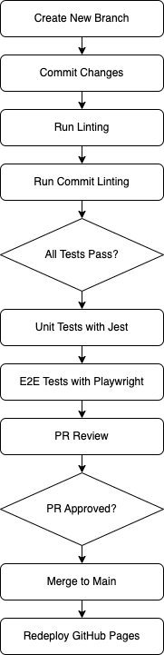

# Phase 2: CI/CD Pipeline Status Report

## Introduction

This document provides an overview of the updated status of our CI/CD pipeline setup, detailing new implementations and fixes since the last report. Our continuous goal is to establish a robust, automated process that ensures/enforces **code quality** and smooth deployment.

## Updated Pipeline Configuration

Our CI/CD pipeline has been enhanced to include end-to-end (E2E) testing with Playwright and unit testing with Jest. Additionally, improvements have been made to our commit linting process. Below is an overview of the updated steps:

1. **Branch Creation**: Developers are required to create new branches for every new set of features or fixes. This ensures that the `main` branch remains stable.

2. **Commit and Push**: Changes are committed to these branches. Commit messages must follow the Conventional Commit's style guide.

3. **Automated Linting**: Pushed commits trigger automated linting processes to check for syntax errors and enforce coding standards.

4. **Commit Message Linting**: Alongside code linting, commit messages are now correctly verified against standard formats to maintain consistency.

5. **Pull Request (PR) Creation**: Once linting passes, a PR is created for code review.

6. **Code Review**: The PR must be reviewed and approved by at least one team member. This step ensures that all code is reviewed for quality and functionality.

7. **Unit Testing with Jest**: Before merging, Jest runs unit tests to verify that individual units of code function as expected.

8. **E2E Testing with Playwright**: After unit tests, Playwright runs end-to-end tests to ensure the application works correctly from the user's perspective.

9. **Merge to Main**: Approved PRs are merged into the main branch, which triggers the final deployment step.

10. **Deployment**: Changes in the `main` branch automatically trigger the deployment to GitHub Pages, ensuring that our latest build is always available.

*Note that although this is an Electron app, we deploy continuously to GitHub Pages to give a live-time product experience to our developers and stakeholders (the prof).*

Below is a diagrammatic representation of our updated CI/CD pipeline:

  <!-- Update this with the actual URL of your uploaded diagram -->

## In Progress and Planned Enhancements

While our pipeline is now more comprehensive, we are actively working on several further enhancements to improve efficiency and coverage:

- **Enhanced E2E Tests**: Expanding the scope of E2E tests to cover more user scenarios.

- **Performance Testing**: Integrating performance tests to ensure the application meets our speed and responsiveness criteria.

- **Security Testing**: Implementing security tests to identify and fix vulnerabilities early in the development process.

## Conclusion

The updated pipeline now includes comprehensive unit and end-to-end testing, ensuring higher code quality and functionality. The ongoing enhancements will further strengthen our CI/CD process, making it a well-defined and reliable part of our development culture.

**Note: All the above implementations are proposed and it is the responsibility of the user to execute them.**
