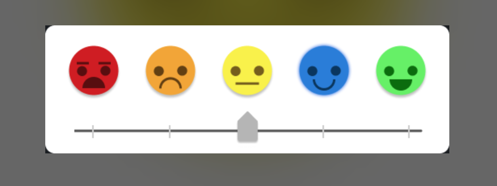

# Warm-Up Activity Meeting 4/23/2024

### Start Time: 4:15 PM
### End Time: 4:50 PM

### Attendance
1. Jesus
2. Sean
3. Reisandy
4. Pranav
5. James
6. Cameron
7. Logan
8. Nicholas

### Agenda
1. Discuss the design of warmup activity #1

    - Clicking Tab would go into the scrolling widget, then use the Left and Right arrow keys to choose the value
    - Set a whole number value for each emoji emotion
    - Styling: a glowing and enlarging effect is visible when the emotion is chosen, add a border
    - Pair programming type of assignment since we have little time and a smaller project
2. Brainstorms on creating the different issues on GitHub
3. Delegating tasks for the warmup activity

