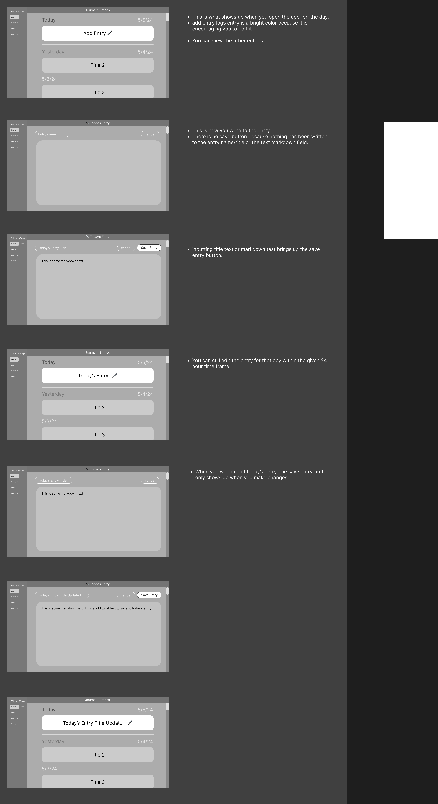

# Decision MVP Design ADR

## Issue
- Time Constraint (3-4 weeks to complete the project)
- We want the journal app to be minimalistic, Local First, and User Focused

## Assumptions
- It will be important for the skeleton of the Front End to be created first then we will finish with the styling
- Back End should be able to research their part even if the skeleton is not finished
    - once skeleton is done, implementing the Back End functionality is important
- Make sure the page is responsive
- Left column of the journal creation and displaying the journals has a button to toggle the page 
- Most people will individually unless they want to pair program

## Decision
- Actions/Flow:
    - Clicking the + button from the main page would bring the user to the Entry page
    - Clicking the save button in the Entry page would add the entry to the Main Page with the Timeline View
    - Selecting an entry from the Main page would then clicking the Edit button would bring the user back to the Entry page with all of the data populated such as Title, date, any texts in the text field
    - Clicking the import icon, would bring up the Import page, allowing users to import files from their computer
    - Clicking the export icon, would zip all of the selected documents and save it on the user’s computer
- Design:

## Status
- Approved: MVP Design
- Approved: Actions/Flow

## Argument
- By having the left column to be toggable, it creates more space in the Entry and Homepage for the user, and differentiate the location of both the journals and entries
    - It allows user to choose which journals they want to see, and display the entries for that specific journals
- By having the entries in the middle of the page, it allows the user to see all of the entries that are associated to that specific journals, and allow the user to add a new entry or edit the existing entry by clicking on that existing entry
- A Homepage will be created to show the current user's information, and available existing journals and entries
- An Entry page will allow the users to write in the entries, set a title, etc
- An import and export button will allow the user to differentiate when to import, and export, and gives the usability of transporting files to and from other devices